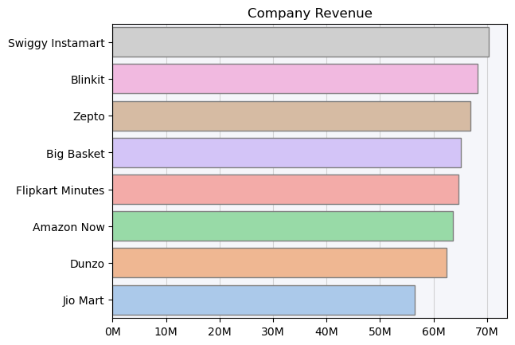
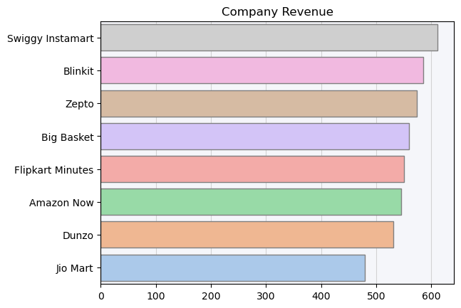
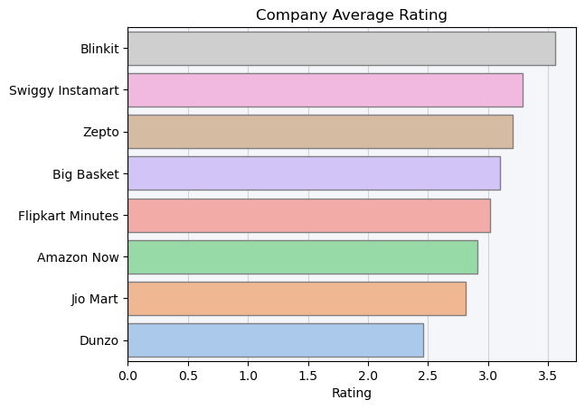
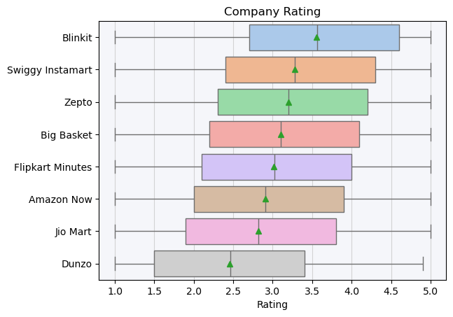
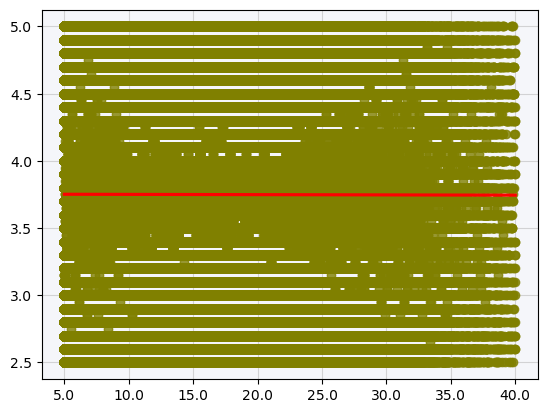
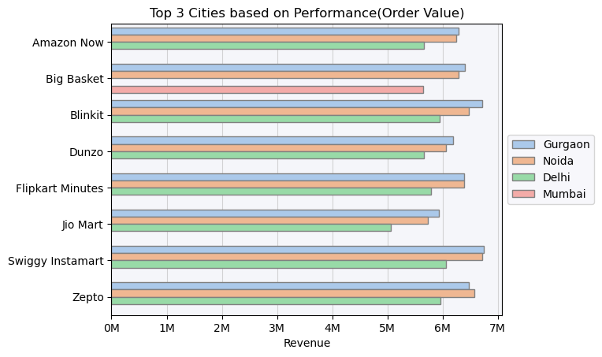
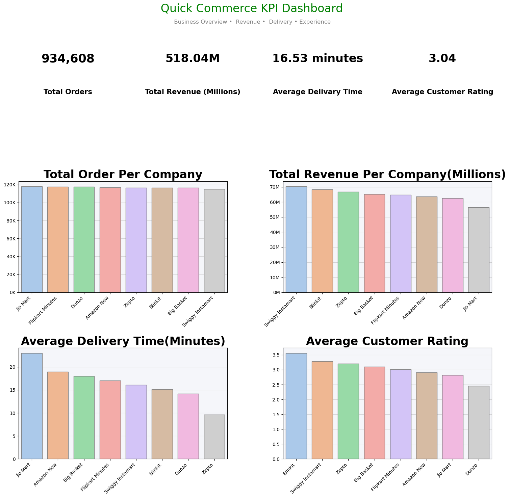

# 🛒 Quick Commerce Data Analysis & KPI Dashboard

## 📌 Project Overview
In this project, I analyzed a real-world **Quick Commerce dataset** to uncover operational, financial, and customer experience insights.

This project demonstrates end-to-end data analysis — from cleaning messy data to building a full KPI dashboard in Python.

---

## 🚀 Project Highlights

✅ Understanding messy real-world data  
✅ Cleaning missing values & handling outliers properly  
✅ Performing Exploratory Data Analysis (EDA)  
✅ Asking real business questions  
✅ Creating powerful visualizations  
✅ Building a full KPI Dashboard in Python  
✅ Extracting meaningful business insights  

---

## 📊 KPI Dashboard

The dashboard includes:

- **Total Orders**
- **Total Revenue**
- **Average Delivery Time**
- **Average Customer Rating**
- Company-level performance comparisons

---

## 📈 Business Questions & Insights

### 1️⃣ Which company has the highest total revenue?

---

### 2️⃣ Which company has the highest average order value?

---

### 3️⃣ How does customer rating vary across companies?

---

### 4️⃣ What is the relationship between delivery time and delivery partner rating?

---

### 5️⃣ What is the most popular product category on Swiggy Instamart for customers aged 30–40 in Mumbai?

**Answer:** 🥛 Dairy

---

### 6️⃣ Which cities should companies expand into based on performance?

---

### 7️⃣ Are discounts increasing order volume or just decreasing revenue?

**Insight:**  
Discounts are effective at selling highly priced items.  
As they have lower order volume but do not necessarily reduce overall revenue.

---

### 8️⃣ Which company has the best operational efficiency (Delivery Time vs Order Volume)?

**Answer:** 🚀 Zepto  

---

### Dashboard

## 🛠 Tools & Technologies Used

- Python
- Pandas
- NumPy
- Matplotlib
- Seaborn

---

## 🎯 Key Takeaways

- Operational efficiency is a key differentiator in quick commerce.
- Discounts can strategically drive premium product sales.
- Delivery time directly impacts customer satisfaction.
- Data-driven expansion decisions improve business growth potential.

---

## 📌 Conclusion

This project showcases how data analysis can transform raw operational data into actionable business insights and strategic recommendations.

It reflects practical skills in:
- Data Cleaning
- Business Analytics
- Dashboard Building
- Insight Communication

---
